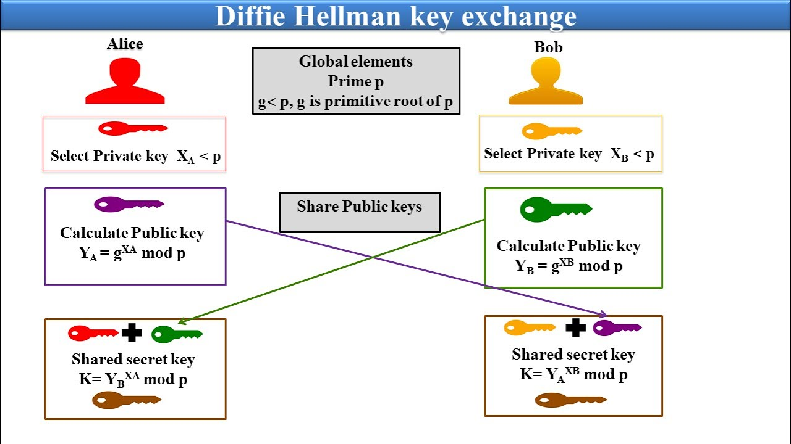

## Asymmetric Key 

### Target
Create a application to encript a plain text using Encription Technique (AES) for other people with more secure and trust

### Techiniques
#### Key Exchange

##### Difie-Hellman Key Exchange

a is secret key of Alice  
A is public key of Alice

b is secret key of Bob  
B is public key of Bob

K = g^(ab) = A^b = B^a is share public keys of both = synmmetric secret key from exercise 1

##### ECIES 
ECDH => AES, ECIES for extra, ECDSA for trust

##### ECDSA => Sign IDs & Config 
Goal: Check who receiver is ?

##### Find more RSA